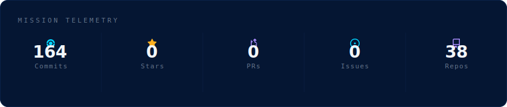

  

  #### Analista de Sistemas focado no ecossistema Java, desenvolvendo soluções robustas para a indústria e explorando arquiteturas modernas como Hexagonal e DDD. Atualmente finalizando Bacharelado em Sistemas de Informação pelo IFSULDEMINAS.
  

  

 

  

 

  

 

  

## 
Minhas Especializações

- #### **Backend Core** — Domínio de Java 21, Spring Boot, JPA/Hibernate e bancos de dados relacionais (PostgreSQL).
- #### **Arquitetura e Qualidade** — Aplicação de Clean Architecture, Hexagonal e Domain-Driven Design (DDD) com foco em testes complexos e robustez.
- #### **Ecossistema Frontend** — Desenvolvimento de interfaces modernas com TypeScript, React e estilização avançada com CSS & Tailwind.
- #### **Sistemas Industriais** — Experiência prática na construção de sistemas ERP complexos do zero para gestão fabril.
- #### **CRM Corporativo** — Desenvolvimento prático em um CRM para prospecção de clientes no mercado B2B.

## 
Metas de Carreira

- #### Consolidar carreira como **Java Developer** com foco em Sistemas Críticos, Bancários e Industriais.
- #### Concluir o Bacharelado em Sistemas de Informação e iniciar Mestrado.
- #### Contribuir para a educação tecnológica como professor universitário.

 

  
   
  
  
  

 

Programo há mais de **5 anos**, com um diferencial forte: trago **5 anos de background como Designer**. Meu foco não é apenas "fazer funcionar", mas criar arquiteturas escaláveis (Clean Arch) e interfaces visualmente impactantes.

* 🔭 **Foco:** Arquitetura Back-End, Java com Spring, Design Systems, Clean Code.
* 🔭 **Habilidades:** Habilidades com UX/UI, Front-End, Inglês.
* 🎓 **Formação:** Sistemas de Informação.
* ⚡ **Hobbies:** Design, Games & Musculação.

 

  <table border="0" width="100%" cellspacing="0" cellpadding="0">
    <tr>
      <td align="center" width="50%">
        
      </td>
      <td align="center" width="50%">
        
      </td>
    </tr>
  </table>

 

---

### 🛠️ Arsenal Tecnológico

  
  **Front-End & Core**
   
  
  
    

  **Backend, Mobile & Tools**
   
  
  
    

  **Design & Prototipagem**
   
  

 
