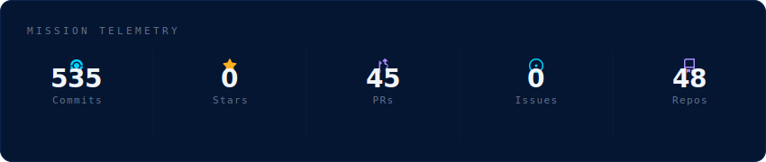

  

  #### Desenvolvedor Back-end focado no ecossistema Java, desenvolvendo soluções robustas para a indústria e explorando arquiteturas modernas e funcionais. Atualmente finalizando Bacharelado em Sistemas de Informação pelo IFSULDEMINAS.
  

  

 

  

 

  

 

  

<!-- ESPECIALIZAÇÃO -->

 

 

 
---
 
## Sobre Mim
 

 
Programo há mais de **5 anos**. Comecei como Designer — hoje construo sistemas backend que precisam funcionar de verdade, em produção, sob pressão. O background em design não me faz frontend: me faz um backend developer que entende produto, comunica bem e entrega APIs que outras pessoas conseguem usar.
 
**Foco:** Desenvolver Produtos e Soluções com Java & IA Aplicada
 

 
---
 
##  Especialização
 
<table>
<tr>
<td width="50%" valign="top">
 
**🔷 Backend & Sistemas Críticos**
Construção de APIs REST transacionais com Java, Spring Boot e PostgreSQL. Foco em consistência, segurança e regras de negócio complexas.
 
**🔷 Arquitetura de Software**
Clean Architecture, Hexagonal Architecture e SOLID aplicados em projetos reais — com ênfase em testabilidade e separação de responsabilidades.
 
</td>
<td width="50%" valign="top">
 
**🤖 IA Aplicada ao Backend**
Integração de LLMs e automação inteligente em sistemas Java. Agentes com N8N para orquestração de fluxos corporativos.
 
**📐 Design como diferencial técnico**
5 anos como Designer me deram visão de produto rara entre devs backend. Não para desenvolver interfaces — para construir sistemas que outros conseguem usar.
 
**📡 Em construção**
Newsletter técnica sobre Carreira, arquitetura e IA aplicada → em breve em [samueljunqueira.com.br](https://samueljunqueira.com.br/)
 
</td>
</tr>
</table>
 
---
 
## Stack
 

 
### Backend
 

 
---
 
### Infra & DevOps
 

 
---
 
### Cloud
 

 
---
 
### Frontend
 

 

 
---
 
## Metas
 
- Atuar como **Java Backend Developer** em fintech ou indústria em sistemas de alta criticidade
- Aprofundar em arquiteturas distribuídas, Kafka e observabilidade em produção
- Lançar **newsletter técnica** sobre Java, arquitetura e IA aplicada
- Concluir Bacharelado em Sistemas de Informação — IFSULDEMINAS
 
---
 
## Leituras que moldaram minha Visão
 
| Livro | Por quê importa |
|---|---|
| **Clean Code** — Robert C. Martin | Base do código que outros conseguem manter |
| **Clean Architecture** — Robert C. Martin | Separação de responsabilidades na prática |
| **Domain-Driven Design** — Eric Evans | Modelagem de domínios complexos como fintech e indústria |
| **Designing Data-Intensive Applications** — Kleppmann | Fundamentos para sistemas distribuídos e consistência |
| **The Pragmatic Programmer** — Hunt & Thomas | Mentalidade de engenheiro, não só de programador |
 
---
 
##Contato
 

 

 

 
---
 

